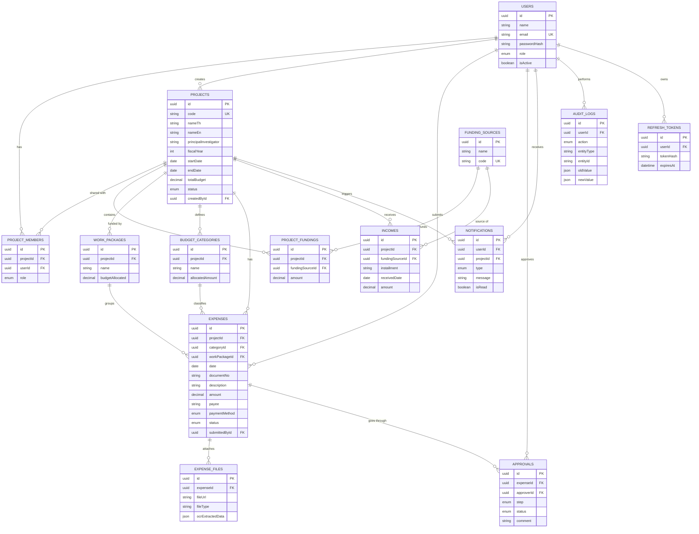

# ER Diagram — RPFMS

ตาราง PK เป็น UUID ทั้งหมด (v4) ยกเว้นไม่มี — FK ทุกจุดตั้ง `onDelete: Cascade` สำหรับ child entity ที่ผูกกับ parent โดยตรง (เช่น ExpenseFile → Expense, ProjectMember → Project) เพื่อป้องกันข้อมูลกำพร้า ยกเว้นความสัมพันธ์เชิงอ้างอิง (เช่น Expense → User submittedBy) ที่คง restrict ไว้

Schema ต้นฉบับ (Prisma, ใช้ generate migration จริง): `backend/prisma/schema.prisma`
