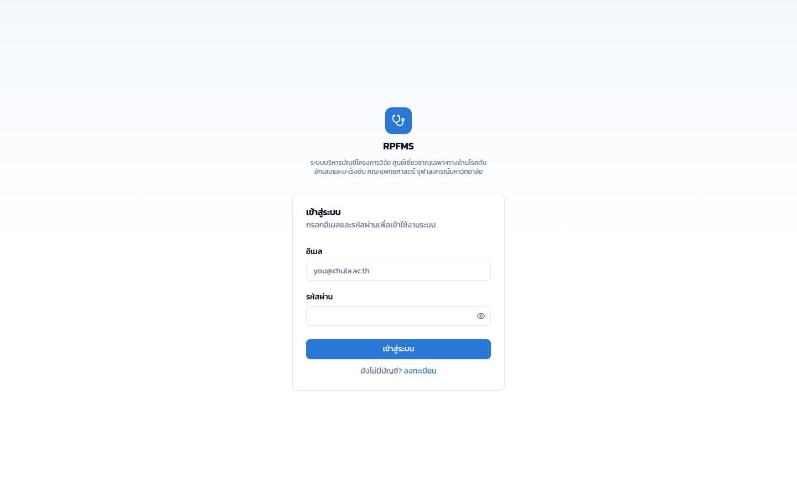
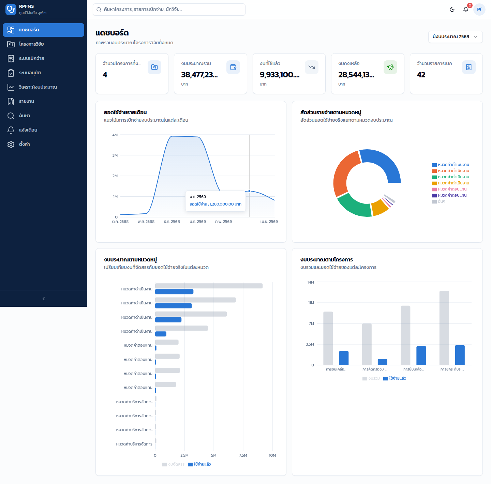
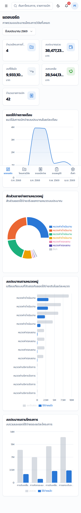
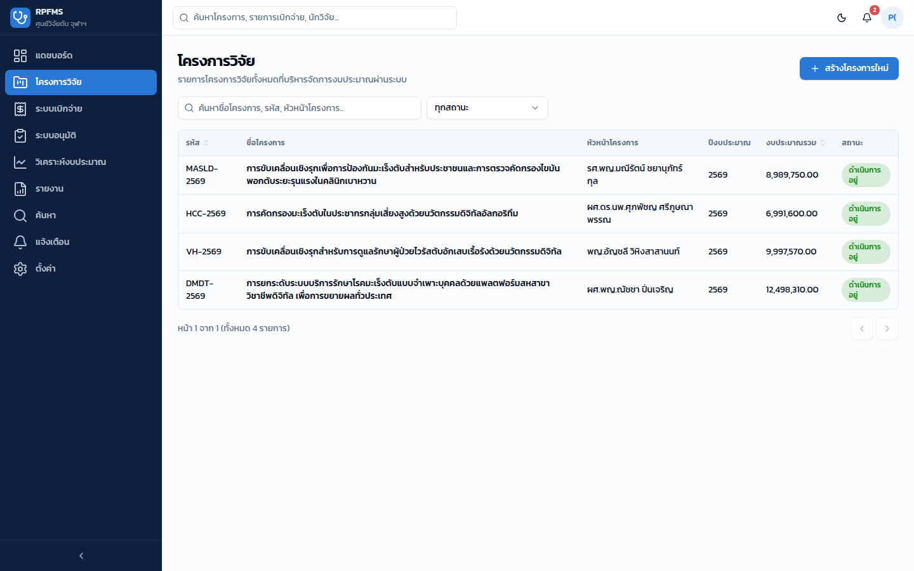
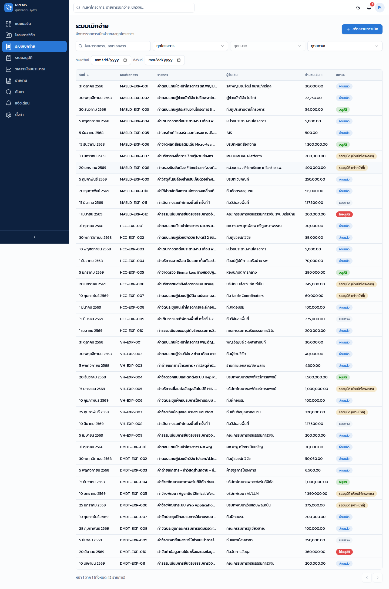
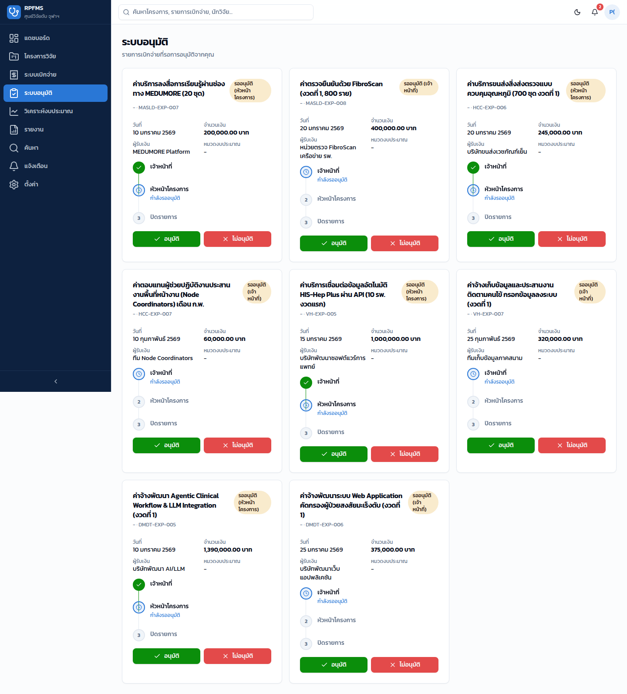
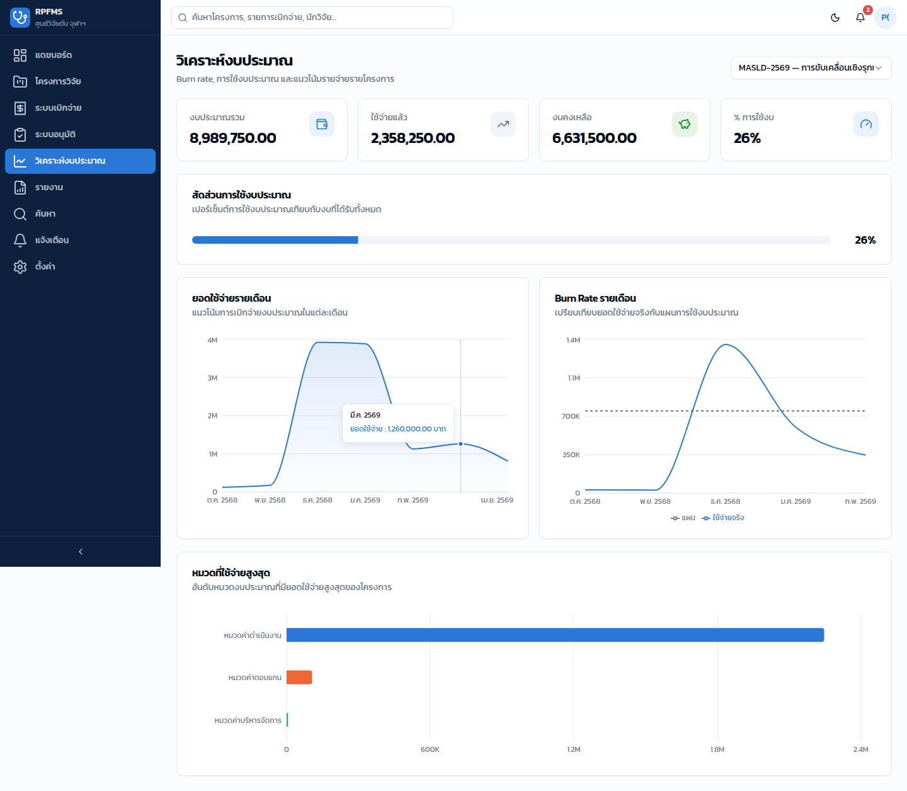
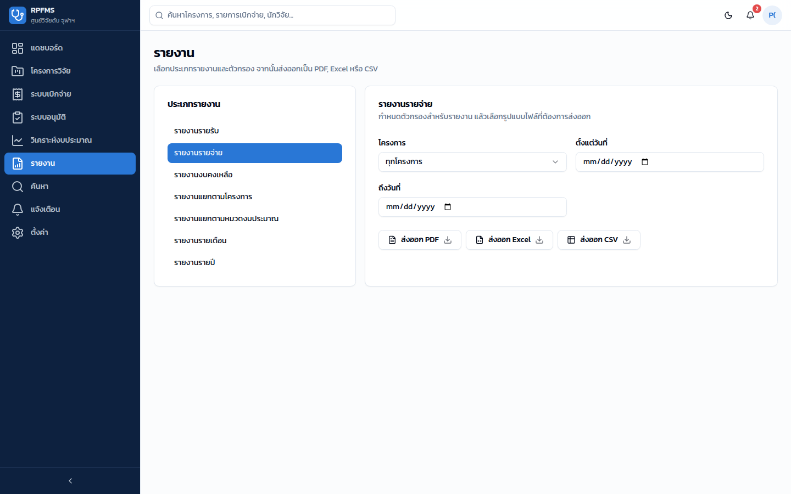
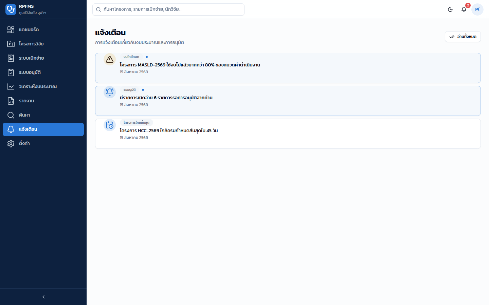

# Mockups — ภาพหน้าจอจริงจากระบบที่ใช้งานได้

ภาพทั้งหมดด้านล่างนี้ไม่ใช่ mockup แบบภาพนิ่งที่วาดขึ้น แต่เป็น**ภาพหน้าจอจริง**ที่ capture จาก source code ใน `frontend/` ที่รันได้จริง โดยใช้ข้อมูลตัวอย่างจาก 4 โครงการวิจัยจริง (ดู `scripts/seed-data.json`)

## เข้าสู่ระบบ

## แดชบอร์ด (Desktop)

## แดชบอร์ด (Mobile — 390px)

## โครงการวิจัย

## ระบบเบิกจ่าย

## ระบบอนุมัติ (Workflow Stepper)

## วิเคราะห์งบประมาณ (Burn Rate / Utilization / Top Categories)

## รายงาน (Export PDF/Excel/CSV)

## แจ้งเตือน

---
หน้าที่เหลือ (สร้าง/แก้ไขโครงการ, สร้างรายการเบิก+OCR, รายละเอียดรายการเบิก, ค้นหา, ตั้งค่า) มี source code ครบใน `frontend/src/app/(app)/` — รันด้วย `npm run dev` แล้วเข้า `http://localhost:3000` เพื่อดูทุกหน้าแบบ interactive (ดูวิธีรันใน `docs/DEPLOYMENT_GUIDE.md`)
